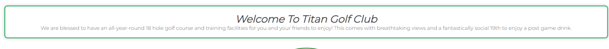

# Titan Golf Club

Welcome to the Titan Golf Club website repository! This README provides an overview of the website, its features, and how to set it up for development or deployment.

## About Titan Golf Club

Titan Golf club is a site that targets an audiance of all ages and ability levels and introudces them to a modern, yet traditional, golf club. The aims of the site are to inform people on the golf club location, update them on the facilities that can be used every-day and create an easy way to become a member.

## Features

1. **Home Page**: The website features an informative homepage with a welcome message, stunning visuals of the golf course, and quick links to other sections.

2. **Facilities**: The facilities page allows users to explore the driving range, putting green, and clubhouse through images and descriptions.

3. **Course Information**: Users are able to get information about the golf course, including scorecards and video tours.

4. **Contact Information**: There are two options to find contact information on the website, through the footer and through the membershp page. They are easy to find to allow for very good user accessibility.

5. **Responsive Design**: The website is designed to work seamlessly on various screen sizes, including mobile devices and desktops.

6. **Google Fonts**: Google Fonts were used to enhance the typography and overall visual appeal of the site.

### Existing features

- **Navigation Bar**

  - Present on all four pages, the fully responsive navigation bar features links to the Logo, Home page, Gallery, and Sign Up page. It maintains consistency across all pages, ensuring effortless navigation.
  - This section enables users to seamlessly move between pages on all devices, eliminating the need to rely on the 'back' button to return to the previous page.

- **Welcome section**

  - The welcome section is simple and precise. It's a piece of text within a green tile that invites the user into the webpage.

- **The opening section**

  - The opening section introduces the user to a peice of text directly in the middle of the screen containing information about the loaction of the club as well as images of scenic views on the golf course.
  - The user will get drawn in to the images and want to find out more about the golf club.

- **History secton**

  - The histroy section allows the user to get to know a little bit of information regarding the past history of the club.
  - The user will become partially knowledgable about the club's past and want to know more.

- **Opening hours section**

  - This section is a simple as it gets. Its purpose is to show when the club is open for business.
  - The user will gain knowledge and understanding on when they can play golf.

- **The footer**

  - The footer includes information on the contact details of the club and also different links to social media pages.
  - The user will find all the information neccessary to get in contact with the club and feel confident in the simple nature of contacting.
  - The footer is the same on every pafe allowing increased user control.

- **The Course page**

  - The course page has two simple sections, a video section showing of the course from a drone POV and a scorecard section where there is an image of the scorecard that is used when playing on the golf course.
  - The user will get to know the golf course and what each hole looks like. They will also gain an understanding on the different yardages of each hole.

- **The facilities page**

  - On the facilities page, the user will find three different sections. Each section gives text information and shows images on what the club has to offer.
  - The first section shows a driving range. It gives information on how many bays are available and how many are inside and outside.

- The second section shows a putting green. It gives information on what is allowed and shows a picturesque image of the green itself.

- The third section shows the clubhouse and gives simple information about it as well as an image that will increase the confidence of the user if they're unsure on what it looks like.

- **The membership page**

  - The membership page shows three different sections. The sections are laid out very clearly allowing any user easy access to all the information that is neccessary to become a member.
  - The first section gives benefits of the membership. This will draw the attention of the user and will increase their confidence in why they should sign up.
  - The second section is simple contact information. If the user hadn't already visited the footer of the website, then the contact information is again laid out, increasing the confidence of their ability to contact the club.

### Features Left to Implement

- **Golf Course Reviews and Ratings**

  - I could create a section/new page where golfers can leave reviews and ratings for both the golf course and its facilities. This would be a place where users can share their experiences, rate the course on various criteria (e.g., course condition, difficulty, scenery), and provide written reviews. This feature would help golfers understand the golf course and show the honest positives and negatives of the overall club.

## Testing

- I tested that this webpage works across mulitple different platforms such as: Chrome, safari and Firefox.
- I tested and confirmed that this project is responsive across all screen sizes from mobile to tablet, all the way upto desktop screens using chrome dev tools.
- I confirmed that all of the navigation links across all of the project work correctly and the user will get taken to the correct places.
- I confirmed that the links to different pages in the header and readable and easy to understand and navigate.
- I have confirmed that the form works. It will only accept a submission when every box is filled out correctly and the submit button works.

### Validator Testing

- HTML

  - No errors were returned when passing through the official [W3C validator](https://validator.w3.org/nu/?doc=https%3A%2F%2Fjamesmackman.github.io%2Ftitan-golf%2F).

- CSS

  - No errors were found when passing through the official [Jigsaw validator](https://jigsaw.w3.org/css-validator/validator?uri=https%3A%2F%2Fjamesmackman.github.io%2Ftitan-golf%2F&profile=css3svg&usermedium=all&warning=1&vextwarning=&lang=en#css).

- Accessibility

  - I confirmed that the colors and fonts chosen are simple and easy to read and accessible by running the webpage through lighthouse in chome devtools.
    

### Unfixed Bugs

- No unfixed bugs

## Deployment

- The site was deployed to GitHub pages. The steps to deploy are as follows:
  - In the GitHub repository, navigate to the Settings tab
  - From the source section drop-down menu, select the Master Branch
  - Once the master branch has been selected, the page will be automatically refreshed with a detailed ribbon display to indicate the successful deployment.

The live link can be found here - <https://jamesmackman.github.io/titan-golf/>

## Credits

### Content

- The design for the header was taken from the Love Running walkthrough project.
- The initial design for the footer was also taken from the Love Running walkthrough project.
- The icons in the footer were taken from [Font Awesome](https://fontawesome.com/).

### Media

- The images on the homepage, the course page, and the faciities page were taken from [Pexels](https://www.pexels.com/) as well as the background image on the membership page.
- The video on The course page was taken from [Youtube](https://www.youtube.com/watch?v=ezRs3jod0hU&t=9s)
